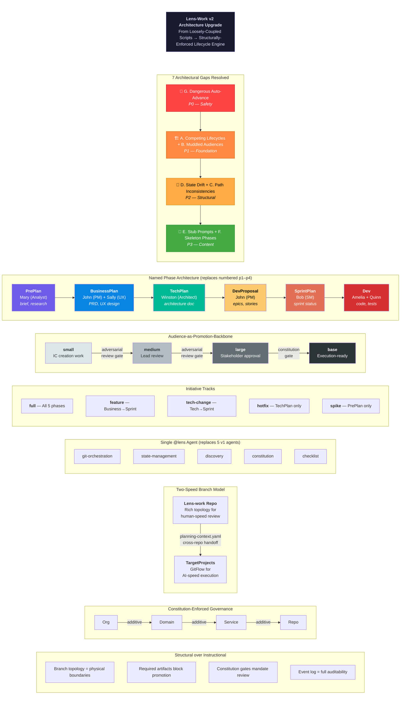

# Lens-Work v2 Architecture Upgrade — Enhancement Overview

**Initiative:** upgrade-cjki9q
**Date:** 2026-02-25

```mermaid
graph TB
    subgraph TITLE [" "]
        direction TB
        T["<b>Lens-Work v2 Architecture Upgrade</b><br/>From Loosely-Coupled Scripts → Structurally-Enforced Lifecycle Engine"]
    end

    subgraph GAPS ["7 Architectural Gaps Resolved"]
        direction TB
        G["🛑 G. Dangerous Auto-Advance<br/><i>P0 — Safety</i>"]
        AB["🏗️ A. Competing Lifecycles + B. Muddled Audiences<br/><i>P1 — Foundation</i>"]
        DC["🔧 D. State Drift + C. Path Inconsistencies<br/><i>P2 — Structural</i>"]
        EF["📝 E. Stub Prompts + F. Skeleton Phases<br/><i>P3 — Content</i>"]
        G --> AB --> DC --> EF
    end

    subgraph PHASES ["Named Phase Architecture (replaces numbered p1–p4)"]
        direction LR
        PP["<b>PrePlan</b><br/>Mary (Analyst)<br/><i>brief, research</i>"]
        BP["<b>BusinessPlan</b><br/>John (PM) + Sally (UX)<br/><i>PRD, UX design</i>"]
        TP["<b>TechPlan</b><br/>Winston (Architect)<br/><i>architecture doc</i>"]
        DP["<b>DevProposal</b><br/>John (PM)<br/><i>epics, stories</i>"]
        SP["<b>SprintPlan</b><br/>Bob (SM)<br/><i>sprint status</i>"]
        DEV["<b>Dev</b><br/>Amelia + Quinn<br/><i>code, tests</i>"]
        PP --> BP --> TP --> DP --> SP --> DEV
    end

    subgraph AUDIENCE ["Audience-as-Promotion-Backbone"]
        direction LR
        S["<b>small</b><br/>IC creation work"]
        M["<b>medium</b><br/>Lead review"]
        L["<b>large</b><br/>Stakeholder approval"]
        B["<b>base</b><br/>Execution-ready"]
        S -->|"adversarial<br/>review gate"| M -->|"adversarial<br/>review gate"| L -->|"constitution<br/>gate"| B
    end

    subgraph TRACKS ["Initiative Tracks"]
        direction TB
        TF["<b>full</b> — All 5 phases"]
        TFE["<b>feature</b> — Business→Sprint"]
        TTC["<b>tech-change</b> — Tech→Sprint"]
        THF["<b>hotfix</b> — TechPlan only"]
        TSP["<b>spike</b> — PrePlan only"]
    end

    subgraph AGENT ["Single @lens Agent (replaces 5 v1 agents)"]
        direction TB
        SK1["git-orchestration"]
        SK2["state-management"]
        SK3["discovery"]
        SK4["constitution"]
        SK5["checklist"]
    end

    subgraph BRANCH ["Two-Speed Branch Model"]
        direction TB
        LR1["<b>Lens-work Repo</b><br/>Rich topology for<br/>human-speed review"]
        TR1["<b>TargetProjects</b><br/>GitFlow for<br/>AI-speed execution"]
        LR1 -->|"planning-context.yaml<br/>cross-repo handoff"| TR1
    end

    subgraph CONST ["Constitution-Enforced Governance"]
        direction LR
        ORG["Org"] -->|additive| DOM["Domain"] -->|additive| SVC["Service"] -->|additive| REPO["Repo"]
    end

    subgraph ENFORCE ["Structural over Instructional"]
        direction TB
        E1["Branch topology = physical boundaries"]
        E2["Required artifacts block promotion"]
        E3["Constitution gates mandate review"]
        E4["Event log = full auditability"]
    end

    TITLE ~~~ GAPS
    GAPS ~~~ PHASES
    PHASES ~~~ AUDIENCE
    AUDIENCE ~~~ TRACKS
    TRACKS ~~~ AGENT
    AGENT ~~~ BRANCH
    BRANCH ~~~ CONST
    CONST ~~~ ENFORCE

    style TITLE fill:none,stroke:none
    style T fill:#1a1a2e,color:#e0e0ff,stroke:#4a4a8a
    style G fill:#ff4444,color:#fff,stroke:#cc0000
    style AB fill:#ff8844,color:#fff,stroke:#cc6600
    style DC fill:#ffaa44,color:#000,stroke:#cc8800
    style EF fill:#44aa44,color:#fff,stroke:#228822
    style PP fill:#6c5ce7,color:#fff
    style BP fill:#0984e3,color:#fff
    style TP fill:#00b894,color:#fff
    style DP fill:#fdcb6e,color:#000
    style SP fill:#e17055,color:#fff
    style DEV fill:#d63031,color:#fff
    style S fill:#dfe6e9,color:#2d3436
    style M fill:#b2bec3,color:#2d3436
    style L fill:#636e72,color:#fff
    style B fill:#2d3436,color:#fff
```
