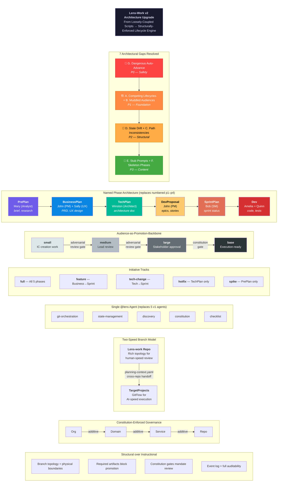

# Lens-Work v2 Architecture Upgrade — Enhancement Overview

**Initiative:** upgrade-cjki9q
**Date:** 2026-02-25



---

## Two-Speed Branching Workflow

The v2 architecture uses a **two-speed branch model** — rich topology in the lens-work repo for human-speed planning review, and GitFlow in TargetProjects for AI-speed code execution. The four planning audience levels mirror the four code merge gates, confirming internal architectural consistency.

**Lens-work repo flow:** Phase branches PR into audience branches. Audience branches promote via PR with adversarial review gates (party mode). All five planning phases execute at the `small` audience level.

**TargetProjects flow:** Story branches PR into epic branches following standard GitFlow. Cross-repo handoff via `planning-context.yaml`.

```mermaid
graph TB
    subgraph LENS_REPO ["Lens-Work Repo — Planning Artifacts&#10;(Rich topology for human-speed review)"]
        direction TB

        subgraph SMALL_WORK ["Audience: small — IC Creation Work"]
            direction TB
            PP_BR["*-small-preplan\nMary (Analyst)\nbrief, research, brainstorm"]
            BP_BR["*-small-businessplan\nJohn (PM) + Sally (UX)\nPRD, UX design"]
            TP_BR["*-small-techplan\nWinston (Architect)\narchitecture doc"]
            SMALL["*-small\n(audience branch)"]
            PP_BR -->|"PR\nphase complete"| SMALL
            BP_BR -->|"PR\nphase complete"| SMALL
            TP_BR -->|"PR\nphase complete"| SMALL
        end

        subgraph PROMO_1 ["Gate: small → medium"]
            R1["Adversarial Review\nParty Mode\nMulti-agent group discussion"]
        end

        subgraph MEDIUM_WORK ["Audience: medium — Lead Review"]
            direction TB
            DP_BR["*-medium-devproposal\nJohn (PM)\nepics, stories, readiness"]
            MEDIUM["*-medium\n(audience branch)"]
            DP_BR -->|"PR\nphase complete"| MEDIUM
        end

        subgraph PROMO_2 ["Gate: medium → large"]
            R2["Stakeholder Approval"]
        end

        subgraph LARGE_WORK ["Audience: large — Stakeholder"]
            direction TB
            SP_BR["*-large-sprintplan\nBob (SM)\nsprint-status, story files"]
            LARGE["*-large\n(audience branch)"]
            SP_BR -->|"PR\nphase complete"| LARGE
        end

        subgraph PROMO_3 ["Gate: large → base"]
            R3["Constitution Gate\n@lens validates track\npermissions + required artifacts"]
        end

        BASE["*-initiative-root\n(= base audience)\nExecution-ready"]

        SMALL -->|"PR\naudience promotion"| R1 --> MEDIUM
        MEDIUM -->|"PR\naudience promotion"| R2 --> LARGE
        LARGE -->|"PR\naudience promotion"| R3 --> BASE
    end

    subgraph HANDOFF ["Cross-Repo Handoff"]
        CTX["planning-context.yaml\nLinks target repo back to\nlens-work planning artifacts"]
    end

    subgraph TARGET_REPO ["TargetProjects — Code Execution&#10;(GitFlow for AI-speed integration safety)"]
        direction TB
        STORY["feature/story\nAmelia (Dev)"]
        EPIC["feature/epic\nFeature-complete review"]
        DEVELOP["develop\nIntegration branch"]
        RELEASE["release/version\nStabilization"]
        MAIN["main\nProduction"]

        STORY -->|"PR\nIC self-review"| EPIC
        EPIC -->|"PR\nLead review"| DEVELOP
        DEVELOP -->|"PR\nRelease readiness"| RELEASE
        RELEASE -->|"PR\nProduction gate"| MAIN
    end

    subgraph ISO ["Planning ↔ Code Review Isomorphism"]
        direction LR
        I1["Phase → small ≅ Story → Epic\nIC self-review"]
        I2["small → medium ≅ Epic → Develop\nLead review"]
        I3["medium → large ≅ Develop → Release\nStakeholder/QA"]
        I4["large → base ≅ Release → Main\nProduction gate"]
    end

    BASE --> HANDOFF --> TARGET_REPO

    style PP_BR fill:#6c5ce7,color:#fff
    style BP_BR fill:#0984e3,color:#fff
    style TP_BR fill:#00b894,color:#fff
    style DP_BR fill:#fdcb6e,color:#000
    style SP_BR fill:#e17055,color:#fff
    style SMALL fill:#dfe6e9,color:#2d3436,stroke:#2d3436,stroke-width:2px
    style MEDIUM fill:#b2bec3,color:#2d3436,stroke:#2d3436,stroke-width:2px
    style LARGE fill:#636e72,color:#fff,stroke:#2d3436,stroke-width:2px
    style BASE fill:#2d3436,color:#fff,stroke:#000,stroke-width:3px
    style R1 fill:#e84393,color:#fff
    style R2 fill:#e84393,color:#fff
    style R3 fill:#d63031,color:#fff
    style CTX fill:#ffeaa7,color:#2d3436,stroke:#fdcb6e,stroke-width:2px
    style STORY fill:#a29bfe,color:#fff
    style EPIC fill:#74b9ff,color:#fff
    style DEVELOP fill:#55efc4,color:#2d3436
    style RELEASE fill:#fab1a0,color:#2d3436
    style MAIN fill:#2d3436,color:#fff,stroke:#000,stroke-width:3px
    style I1 fill:#dfe6e9,color:#2d3436
    style I2 fill:#b2bec3,color:#2d3436
    style I3 fill:#636e72,color:#fff
    style I4 fill:#2d3436,color:#fff
```



### Concrete Branch Example (this initiative)

```
lens-lens-work-upgrade-cjki9q                          # base (initiative root)
lens-lens-work-upgrade-cjki9q-small                    # audience: IC work
lens-lens-work-upgrade-cjki9q-small-preplan            # phase: PrePlan
lens-lens-work-upgrade-cjki9q-small-businessplan       # phase: BusinessPlan
lens-lens-work-upgrade-cjki9q-small-techplan           # phase: TechPlan
lens-lens-work-upgrade-cjki9q-medium                   # audience: lead review
lens-lens-work-upgrade-cjki9q-medium-devproposal       # phase: DevProposal
lens-lens-work-upgrade-cjki9q-large                    # audience: stakeholder
lens-lens-work-upgrade-cjki9q-large-sprintplan         # phase: SprintPlan
```

### Branch Naming Rules

- **Flat hyphen-separated** (no nested `/` paths)
- **Initiative root:** `{domain}-{service}-{feature}-{6char_id}`
- **Audience suffix:** `-small`, `-medium`, `-large` (root = base)
- **Phase suffix:** `-preplan`, `-businessplan`, `-techplan`, `-devproposal`, `-sprintplan`
