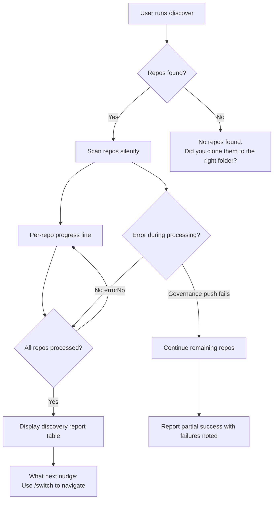
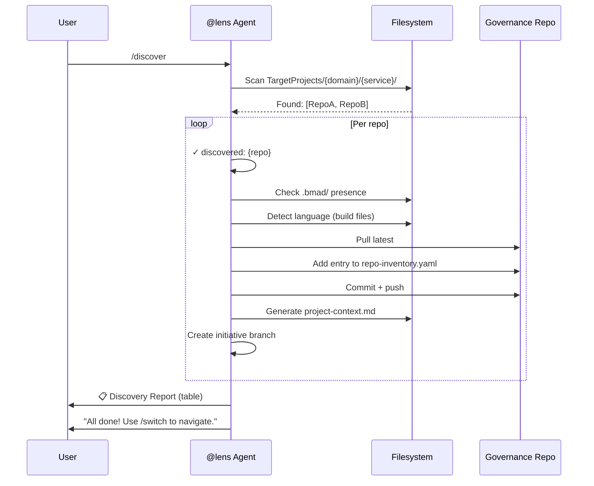
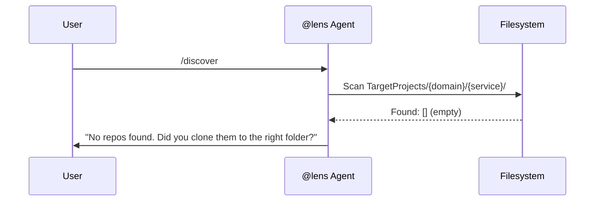
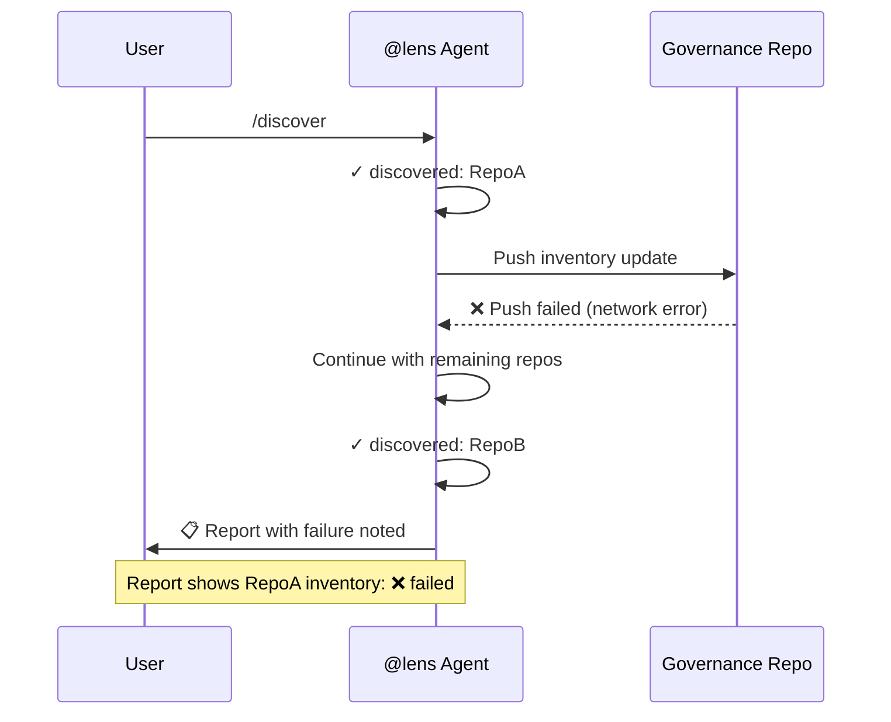

---
stepsCompleted:
  - step-01-init
  - step-02-discovery
  - step-03-core-experience
  - step-04-emotional-response
  - step-05-inspiration
  - step-06-design-system
  - step-07-defining-experience
  - step-08-visual-foundation
  - step-09-design-directions
  - step-10-user-journeys
  - step-11-component-strategy
  - step-12-ux-patterns
  - step-13-responsive-accessibility
  - step-14-complete
inputDocuments:
  - _bmad-output/lens-work/initiatives/bmad/lens/phases/preplan/product-brief.md
  - _bmad-output/lens-work/initiatives/bmad/lens/phases/businessplan/prd.md
  - _bmad-output/lens-work/initiatives/bmad/lens/phases/businessplan/businessplan-questions.md
mode: batch
initiative: bmad-lens-repodiscovery
---

# UX Design Specification — Repo Discovery

**Author:** CrisWeber (facilitated by Sally, UX Designer)
**Date:** 2026-03-09
**Initiative:** bmad-lens-repodiscovery

---

## Product Context

`/discover` is an **agent command** executed in VS Code Copilot Chat. It is not a traditional web/mobile UI. The entire user experience is a conversational interaction: the user types a command, the agent processes silently, and outputs a structured report. There are no screens, forms, or navigation elements — only terminal-style chat output.

**Core Product:** A post-clone lifecycle completer that scans cloned repos, updates governance, generates project context, creates branches, and reports results.

---

## Core Experience Definition

### Primary User Action

The most frequent and critical interaction: **User runs `/discover` and receives a discovery report.**

The entire UX contract is:
1. User types `/discover`
2. Agent scans silently (no mid-process questions)
3. Agent outputs a structured report
4. Agent nudges next action

### What Must Be Effortless

- Running the command (single keyword, no arguments required — context derived from current initiative)
- Understanding the output (table format, clear status indicators)
- Knowing what to do next (always ends with a "what next" nudge)

---

## Desired Emotional Response

| Stage | Desired Feeling |
|-------|----------------|
| Before running | Confident — "I know this will handle post-clone setup" |
| During execution | Calm — minimal progress output, no anxiety about what's happening |
| After completion | Satisfied — clear table shows exactly what was found and done |
| On error | Informed — clear error message, no ambiguity about what failed |
| On empty folder | Guided — helpful message directs to correct folder |

---

## Interaction Design

### Command Flow



### Progress Output Pattern

**Verbosity level: Minimal** (one line per repo)

```
✓ discovered: NorthStarET
✓ discovered: OldNorthStar
✓ discovered: ConfigRepo
```

No per-step details (no "detecting language...", "updating inventory..."). Progress is repo-level only.

### Error & Warning Indicators

Use standard emoji prefixes consistent with existing lens-work output:

| Indicator | Meaning | Example |
|-----------|---------|---------|
| ✓ | Success | `✓ discovered: RepoName` |
| ❌ | Error | `❌ Error: Governance push failed` |
| ⚠️ | Warning | `⚠️ Warning: RepoX already in inventory` |

---

## Output & Report Design

### Discovery Report Format

**Format: Table** (per user specification)

```
📋 Discovery Report — {domain}/{service}

| Repo | Language | BMAD Config | Inventory | Context | Branch |
|------|----------|-------------|-----------|---------|--------|
| NorthStarET | typescript | ✓ | ✓ added | ✓ generated | ✓ created |
| OldNorthStar | csharp | ✗ | ✓ added | ✓ generated | ✓ created |
| ConfigRepo | unknown | ✗ | ✓ added | ⚠️ skipped | ✓ created |

✅ 3 repos discovered, 3 added to inventory, 2 project-context generated

All done! You can now use /switch to navigate to any discovered repo.
```

**Report structure:**
- Structured, data-first (not conversational)
- Table with columns: Repo, Language, BMAD Config, Inventory status, Context status, Branch status
- Summary line with counts
- "What next" nudge with actionable command

### Zero-Repo Output

When the service folder is empty or has no `.git/` directories:

```
No repos found. Did you clone them to the right folder?
Expected: TargetProjects/{domain}/{service}/
```

No table, no report structure — just the guidance message.

### Idempotency Output

When repos already exist in inventory:

```
⚠️ Warning: NorthStarET already in inventory
  → Update existing entry? [Y]es / [S]kip / [A]ll
```

---

## Agent Persona & Tone

### Persona

The `@lens` agent runs `/discover` directly. No sub-persona switch — this is a utility command, not a planning workflow requiring a specialist agent.

### Tone: Helpful & Instructive

| Interaction Point | Tone Example |
|-------------------|-------------|
| Pre-discovery prompt | "Clone your repos to `TargetProjects/{domain}/{service}/` and reply 'done' when ready." |
| Progress | "✓ discovered: RepoName" |
| Success | "All done! You can now use `/switch` to navigate to any discovered repo." |
| Error | "❌ Error: Governance push failed — continuing with remaining repos." |
| Empty folder | "No repos found. Did you clone them to the right folder?" |

### Mid-Discovery Behavior

**Complete silently.** The agent never asks clarifying questions during discovery processing. All decisions are either pre-configured (via initiative config) or handled with sensible defaults. The only interactive moment is the idempotency prompt (warn-and-ask when repos already exist in inventory).

---

## User Journey Flows

### Journey 1: Happy Path



### Journey 2: Empty Folder



### Journey 3: Partial Failure



---

## Component Strategy

This is a CLI/chat agent command. There are no UI components in the traditional sense. The "components" are:

| Component | Description |
|-----------|-------------|
| Progress line | Single `✓ discovered: {name}` line per repo |
| Report table | Markdown table with repo status columns |
| Summary line | `✅ N repos discovered, N added to inventory...` |
| Nudge line | `All done! You can now use /switch to navigate...` |
| Error line | `❌ Error: {description}` |
| Warning line | `⚠️ Warning: {description}` |
| Empty message | `No repos found. Did you clone them to the right folder?` |
| Idempotency prompt | `⚠️ Warning: {repo} already in inventory → [Y]es/[S]kip/[A]ll` |

---

## Accessibility & Constraints

- No specific terminal/chat rendering constraints identified
- Screen-reader friendliness is not required
- No character or length constraints on report output
- Tables are acceptable in VS Code Copilot Chat (markdown renders correctly)
- Emoji indicators (✓, ❌, ⚠️) used for visual scanning — no text-label alternatives required

---

## Design Decisions Log

| Decision | Choice | Rationale |
|----------|--------|-----------|
| Progress verbosity | Minimal (one line per repo) | User preference; avoids noise |
| Report format | Table | User preference; structured, scannable |
| Report tone | Structured/data-first | Agent utility command, not conversational assistant |
| Mid-discovery questions | Never | Complete silently, report at end |
| Error handling UX | Continue + report partial | Zero data loss contract; user sees what failed |
| Persona | @lens (no sub-persona) | Utility command, not specialist workflow |
| Tone | Helpful/instructive | User preference |
| Empty folder message | Direct guidance with expected path | User-specified wording |
| What-next nudge | Always present after success | User confirmed |
